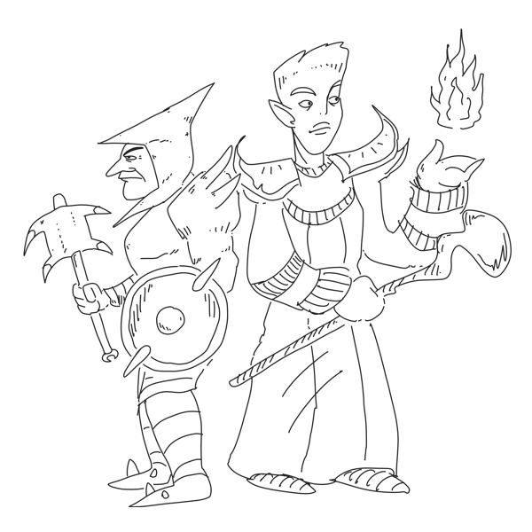

# Levels & Limits

Configurable maximum skill levels.

## Mod Overview

This mod lets you make your playthrough more challenging by setting skills caps, reducing gained experience and more!

## Features

**Skill Caps Options** You can can set maximum skill levels for your major, minor and miscellaneous skills. You can further reduce these maximum levels based on your class, favored attributes and race.

**Skill Experience Options** You can reduce the gained experience to make your playthrough more challenging. You can make the amount of gained experience based on individual skills!

There are many more options and ways to customize your experience. Make sure to open the mod configuration and review the possibilities!

This mod limits the maximum skill levels based on whether the skills are major, minor, or miscellaneous. By default, the maximum levels are set to 100 for major skills, 75 for minor skills, and 35 for miscellaneous skills.

Your class specialization, favored attributes, and race skill bonus further limit your maximum skill levels. Skills that do not match your specialization will have a reduced maximum level. Skills not governed by your favored attributes will also have a reduced maximum level. Also, skills not matching a skill bonus from your chosen Race will also receive a reduced maximum skill level. The skill bonus amount doesn't matter, only if there is a bonus or not.

As an additional feature, skills will stop leveling up once the character gained enough progress for a new level. Rest and meditate to continue improving your skills.

All features are toggleable and customizable. This mod works with both vanilla and custom classes.

*OpenMW 0.49 or newer is required, incompatible with NCGDMW.*

## Calculation examples

Here are some examples of how class and race combinations affect the maximum skill level:

* An Orc Warrior uses Combat as specialization and Strength and Endurance as favored attributes. Heavy Armor is a major skill, governed by Endurance, and is from the Combat specialization. Also, orcs receive a bonus on heavy armor. The orc warrior will be able to reach level 100 in Heavy Armor due to the skill being a perfect match with its class and race.
* An Imperial Acrobat uses Stealth as specialization and Agility and Endurance as favored attributes. Unarmored is a major skill, yet is governed by Speed, and is from the Magic specialization. The maximum skill level for Unarmored is reduced to 85, down from 100, since it doesn't share a governed attribute (-5), specialization (-5) with its class. Also, the imperial doesn't receive a bonus for Unarmored. (-5)
* A Nord Witchhunter uses Magic as specialization and Intelligence and Agility as favored attributes. Mysticism is a minor skill, yet is governed by Willpower. The maximum skill level for Mysticism is reduced to 65, down from 75, since it doesn't share a governed attribute (-5). Also, the nord doesn't receive a bonus for Mysticism. (-5)
* A Wood Elf Thief uses Stealth as specialization and Speed and Agility as favored attributes. Axe is a miscellaneous skill, governed by Strength, and is from the Combat specialization. The maximum skill level for Axe is reduced to 20, down from 35, since it doesn't share a governed attribute (-5) or specialization (-5) with its class. Also, the wood elf doesn't receive a bonus for Axe. (-5)

*I hope you'll enjoy my mod!*
